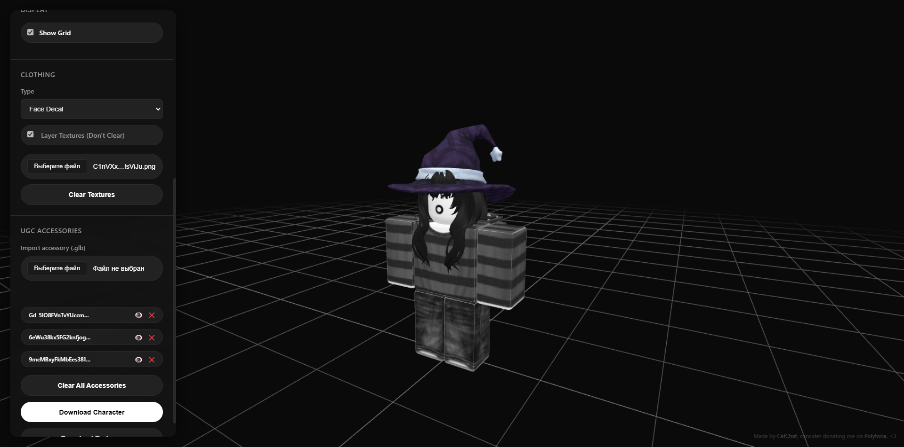

# 🎨 Polytoria Avatar Toolkit

A powerful web-based tool for creating, customizing, and previewing Polytoria avatars in real-time. Built with Three.js for a smooth 3D experience.



## ✨ Features

### 🔄 Template Conversion
- **Roblox ↔ Polytoria**: Seamlessly convert shirt templates between Roblox and Polytoria formats
- Instant conversion and download with proper UV mapping

### 🎨 Customization
- **Skin Tone**: Pick any color for your character's skin
- **Background**: Customize the viewport background color
- **Grid Display**: Toggle a fading grid helper for better depth perception

### 👕 Clothing Preview
- **Multi-layer Support**: Preview shirts, pants, and face decals simultaneously
- **Layered Textures**: Option to layer multiple clothing items without clearing previous ones
- **Real-time Updates**: See changes instantly as you upload textures

### 🎭 UGC Accessories
- **Import Support**: Load custom .glb accessories (up to 9 at once)
- **Toggle Visibility**: Show/hide individual accessories
- **Management**: Easy-to-use interface for removing or clearing all accessories

### 💾 Export Options
- **Download Textures**: Export all applied textures as a ZIP archive
- **Download Geometry**: Save your customized character model as a .glb file

## 🚀 Getting Started

### Online Version
Visit the live demo: 

### Local Setup
1. Clone this repository:
```bash
git clone https://github.com/CatChat0/polytoria-avatar-toolkit.git
cd polytoria-avatar-toolkit
```

2. Open `index.html` in your browser or use a local server:
```bash
# Python 3
python -m http.server 8000

# Node.js
npx http-server
```

3. Navigate to `http://localhost:8000`

## 📖 Usage

### Converting Templates
1. Select conversion mode (Roblox → Polytoria or vice versa)
2. Upload your template image
3. Click "Convert & Download"

### Customizing Your Avatar
1. Load a character model (auto-loads on start)
2. Adjust skin tone and background colors
3. Upload clothing textures (shirts, pants, face decals)
4. Import UGC accessories as needed

### Exporting
- **Textures**: Click "Download Textures" to get all applied textures in a ZIP
- **Model**: Click "Download Character" to save the complete 3D model

## 🛠️ Built With

- [Three.js](https://threejs.org/) - 3D graphics library
- [JSZip](https://stuk.github.io/jszip/) - ZIP file generation
- Vanilla JavaScript - No frameworks needed

## 📁 Project Structure

```
polytoria-avatar-toolkit/
├── index.html          # Main HTML file
├── style.css           # Styling
├── script.js           # Core functionality
├── character.glb       # Default character model
├── smile.png           # Default face decal
├── preview.png           # Preview for README
└── README.md           # Documentation
```


## 🤝 Contributing

Contributions are welcome! Feel free to:
- Report bugs
- Suggest new features
- Submit pull requests

## 📝 License

This project is open source and available under the [MIT License](LICENSE).

## 💖 Support

If you find this tool helpful, consider:
- Starring the repository ⭐
- Sharing it with friends
- [Supporting me on Polytoria](https://polytoria.com/u/C4TCH4T)

## 👨‍💻 Author

**CatChat**
- GitHub: [@YourGithubUsername](https://github.com/CatChat0)
- Polytoria: [Your Profile](https://polytoria.com/u/C4TCH4T)

---

Made with ❤️ for the Polytoria community
